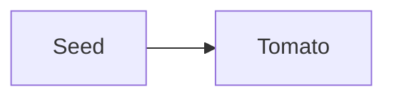

The graph widget's local view is anchored here, so this note's neighbours are
the ones a local view should show — and nothing else in the vault should appear.

Neighbours: [[Soil pH (basics)#Details]] and [[Baker's Dozen]].

```typescript
const crop = "tomato";
```



%% private growing note %%
