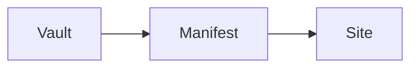

# Rich visible content

Code keeps its authored language and remains horizontally scrollable. The page
adds a copy action without changing the code text.

```typescript
const greeting: string = "hello from a deliberately long code line that can scroll without widening the page";
console.log(greeting);
```

Mermaid fences remain an accessible source fallback when no build-time Mermaid
renderer is installed.



%% This editorial comment must never appear in the rendered page or search. %%

Only explicit privacy-enhanced YouTube and Vimeo player URLs become sandboxed,
responsive embeds; the caption remains a fallback link.


